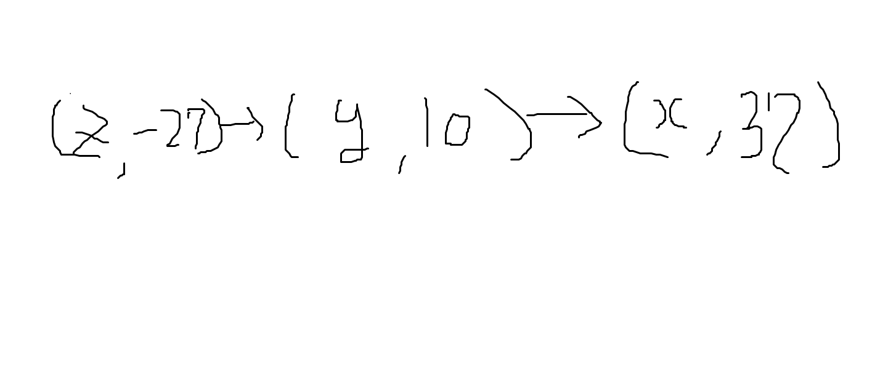

# Intro
지난 시간에 간단한 형태의 프로그래밍 언어를 설계해보았다. 이젠 조금 더 깊이 들어가, (나중에)


# Nameless proc
잠깐 돌아가서 스코핑에 관해 조금 더 알아보자. 앞서 언급하였듯 우리는 scoping에 대해 lexical(static) / dynamic scoping 중 하나를 채택할 수 있으며, 일반적으로 lexical scoping이 더 typical하다. 이번엔 lexical scoping에 대해 조금 더 자세히 알아보고, lexical scoping으로 인해 구현할 수 있는 nameless representation이 적용된, **nameless proc** 언어를 세워보자.

## More about Lexical Scoping  
### Static / Dynamic Property
계속 static / dynamic이라고 표현하지만, 왜 이러한 term을 사용하는 걸까? 여기서 각각의 개념도 짚고 넘어가자. 프로그램에서, static / dynamic한 property는 보통 다음을 의미한다.

- Static property: can be computed w/o executing the program
- Dynamic property: can be determined only by executing the program(run-time).
  
이러한 점에서 보아, 변수의 타입(type)은 C/C++에선 static이나, Python에선 dynamic하다.

### Variables
모두가 알고 있겠지만, 변수는 두 방식으로 프로그래밍 언어에서 나타난다.

- Declaration: 어떤 값(value)의 이름으로서 변수를 설정한다.
- Reference: 변수에 대응되는 값을 사용하기 위해 참조한다.

여기서, 변수의 참조는 그 변수와 연관된 선언(declaration)과 변수에 대한 값(value)에 bound된다고 표현된다.

### Lexical Depth
우리가 변수를 참조(reference)할 때, 우린 그 참조에 매칭되는 선언(declaration)을 찾아야 한다. 예를 들어, 아래 코드를 보자.

```
let x = 1
  in let y = 2
    in x + y
```

Line 3의 expression을 evaluate하기 위해, 우리는 line 1, 2의 declaration을 찾아야 하고, 직관적으로 우린 $x$가 $y$보다 더 멀리 있음을 알 수 있다. Lexical depth는 이처럼 "얼마나 declaration이 멀리 떨어져있는가?"에 대한 지표가 된다. 다음과 같이 정의하자.

> Lexical depth: # of declarations crossed to find the corresponding declaration

이러한 정의에 따르면, 위 예시에서 $x$의 lexical depth는 $1$, $y$는 $0$이다.

### Lexical Address
표현식 각각에서 변수가 가지는 lexical depth는 reference를 bind하는 declaration을 uniquely identify한다. 그렇다면, 우리는 변수의 이름을 쓸 필요 없이 lexical depth만으로 그에 대응하는 declaration을 찾을 수 있지 않을까? 그런 아이디어에서, 변수 이름을 lexical depth로 치환한 것을 lexical address라 한다.

위의 lexical depth 예시는 다음과 같이 치환될 수 있다.

```
let 1
  in let 2
    in #1 + #0
```

이러한 표기를 nameless representation, 혹은 De Bruijn representation이라고 한다. 말 나온 김에 한 두개 더 해볼까?

```
(let x = 37 
  in proc y
    let z = y - x
      in z - y) 10

(let 37
  in proc
    let #0 - #1
      in #0 - #1) 10
```


## Nameless proc
이제, 우리가 설계한 **proc**에서, 변수 이름을 제거해보자. 아래는 nameless proc의 syntax가 되겠다.

$$ P \to E $$ 
<br>$$ E \to n \in \mathbb{Z} $$
<br>$$  \;\;\;\;\;\mid\;\; \#n $$ 
<br>$$  \;\;\;\;\;\mid\;\; E + E $$ 
<br>$$  \;\;\;\;\;\mid\;\; E - E $$
<br>$$  \;\;\;\;\;\mid\;\; iszero \;E $$
<br>$$  \;\;\;\;\;\mid\;\; if\; E\; then\; E \;else E $$
<br>$$  \;\;\;\;\;\mid\;\; let\; E \;in\; E $$
<br>$$  \;\;\;\;\;\mid\;\; (E)$$
<br>$$  \;\;\;\;\;\mid\;\; proc \;E$$
<br>$$  \;\;\;\;\;\mid\;\; E\; E$$

이제 도메인을 결정해보자.

$$\begin{matrix}
Val: & \mathbb Z + Bool + Procedure\\
Procedure: & E \times Env\\
Env: & Val*\\
\end{matrix}
$$

Env는 어떻게 표현하면 좋을까? 가장 간단한 방법은 해시맵이나 튜플 리스트를 사용하는 것이다.

```
(let x = 37 
  in proc y
    let z = y - x
      in z - y) 10

(let 37
  in proc
    let #0 - #1
      in #0 - #1) 10
```



(똥그림 ㅈㅅ) 이렇게 정확히 lexical address에 대응되는 값을 찾아낼 수 있다!

이제 inference rule을 살펴볼까?

$$
\frac{}{\rho \vdash \#n \implies \rho_n} \\ \; \\
\frac{\rho \vdash E_1 \implies v_1 \;\;\; v_1::\rho \vdash E_2 \implies v}{\rho \vdash let\;E_1\;in\;E_2 \implies v} \\ \; \\
\frac{}{\rho \vdash proc\; E \implies (E, \rho)}
\\ \; \\ \frac{\rho \vdash E_1 \implies (E, \rho')\;\;\;\rho' \vdash E_2 \implies v\;\;\; v::\rho'\vdash E_2 \implies v'}{\rho \vdash E_1 \; E_2 \implies v'}
$$

허이고... 위의 예시를 통해 알아보자.

## Example
```
(let 37
  in proc
    let #0 - #1
      in #0 - #1) 10
```
우선, 직관적으로 이 expression은 $-37$로 evaluate됨을 알 수 있다. 어떤 과정을 통해 evaluation이 이루어졌을까? 

$$
\frac{}{[]\vdash (let\;\;37\;\; in\;\; proc\;\; let\;\; \#0 -\#1\;\;in\;\;\#0-\#1)\;\;10 \implies -37}
$$

어떻게 이 결과에 도달할 수 있었을까? 프로시저 콜에 대한 semantic을 기억하자.

$$
 \frac{\rho \vdash E_1 \implies (E, \rho')\;\;\;\rho' \vdash E_2 \implies v\;\;\; v::\rho'\vdash E_2 \implies v'}{\rho \vdash E_1 \; E_2 \implies v'}
$$

이를 따라 그 과정을 짚어볼 것이다. 오른쪽에서 왼쪽으로 가자.

---
### 1
우선 $v::\rho'\vdash E_2 \implies v'$는 어떨까?

$$
10::[37] \vdash let\;\;\#0-\#1\;in\;\#0-\#1 \implies -37
$$

...인데 머리가 복잡하니 각각이 무엇을 참조하는지 정리해보자.

? | What 
---|---
$let$ 뒤의 \# $0$ | `proc`의 parameter
$let$ 뒤의 \# $1$ | 37
$in$ 뒤의 \# $0$ | $let$ 뒤의 \#$0 - $\#1
$in$ 뒤의 \# $1$ |  `proc`의 parameter

아무튼, 저걸 계산하기 위해선, 그 전에 각 위치의 \#$0-$\#$1$를 알아야 한다. $in$ 뒤부터 계산해볼까? 다음과 같은 env를 가지고 evaluate된다.

$$[27][10, 37] \vdash \# 0 - \# 1 \implies -37$$

$[27]$은 $let$ 뒤에서 계산된 결과로 나온 env다. 앞서 언급했듯, env를 일종의 리스트로 보아 address로 접근할 수 있다. 그에 따라, \#$0$은 $-27$, \#$1$은 $10$으로 계산하여, $-37$이란 결과를 끌어낼 수 있다. 

이제 $let$ 뒤를 계산해보자.

$$[10, 37]\vdash \#0-\#1 \implies -27$$

이게 $in$ 뒤의 evaluation의 env에 추가된다. 그래서 $[-27][10, 37]$과 같이 나타내었다.

---
### 2
$\rho' \vdash E_2 \implies v$는 꽤 자명하다. Env는 가볍게 무시하고, $10$은 $10$으로 evaluate된다.

---
### 3

이제 우리가 써온 env, $\rho'$는 어디서 튀어나왔는지를 보자. $\rho \vdash E_1 \implies (E, \rho')$는 위 코드에서 다음과 같다.

$$[] \vdash proc\;\;let\;\#0-\#1\;in\;\#0-\#1 \\ \implies (let\;\#0-\#1\;in\;\#0-\#1, [37])$$ 

$proc\;E$는 $(E, \rho)$로 결정됨을 기억하자. 사실 이것은 아래에 의한 결과다.

$$[37] \vdash proc\;\;let\;\#0-\#1\;in\;\#0-\#1 \\ \implies (let\;\#0-\#1\;in\;\#0-\#1, [37])$$ 

왜냐? $let$으로 $37$을 env에 추가하여 $proc$이 위와 같이 evaluate된 거라서다. 물론 $\rho \vdash E_1 \implies v_1 $. 즉, $[]\vdash 37 \implies 37$도 포함되어야 한다.

---
이제 아래에서 위로 올라가며 정리할 수 있겠다. 3번으로 env에 $[37]$을 env에 추가하고, 2번으로 $[10]$을 env에 추가했다. 

$let$ 뒤는 $[10, 37]$ env를 가지고, \#$0 -$\#$1 \implies -27$로 evaluate되었으며, 이는 $in$ 뒤를 위해 env에 추가되어, $[27, 10, 32]$ env롤 통해 \#$0 - $\# $1 \implies -37$로 계산된다.

이를 정리하면 (1)번과 같이 $10::[37] \vdash let \; $\# $0 - $\#$ 1 \; \; in \; $\#$ 0 - $\#$ 1 \implies -37$이 되고, 최종적으로 evaluation이 완료된다.

와, 머리가 빙빙 돈다.

## Translation
우리는 $proc$에서 사용한 expression들을 $nameless \;proc$의 expression으로 대체, 즉, 번역(translatation)할 수 있다. 즉, $proc$에 대응하며 같은 결과(value)로 evaluate되는 $nameless \; proc$의 expression을 항상 찾을 수 있단 소리다.

좀 더 정확하게, $proc$ expression을 $nameless\;proc$ expression으로 매핑하는 함수를 정의한다고 볼 수 있다.

$$\text{Trans: } \text{ProcExp} \times Env \to \text{Nameless Proc} \\ Env\;:\;Var*$$

$Trans$는 어떻게 정의될까?

$$\begin{aligned}
\mathbf{trans}(n)(\rho) & = n \\
\mathbf{trans}(x)(\rho) & = \#n\;(\text{n is the first position of x in }\rho) \\
\mathbf{trans}(E_1 \pm E_2)(\rho) & = \mathbf{trans}(E_1)(\rho) \pm \mathbf{trans}(E_2)(\rho) \\  
\mathbf{trans}(iszero\;E)(\rho) & = iszero\;\mathbf{trans}(E)(\rho) \\
\mathbf{trans}(E_1\;then\;E_2\;else\;E_3)(\rho) & = if\; \mathbf{trans}(E_1)(\rho)\;then\;\mathbf{trans}(E_2)(\rho)\; \\ & \quad \; else\;\mathbf{trans}(E_3)(\rho) \\
\mathbf{trans}(let\;x=E_1\;in\;E_2)(\rho) &= let\;x=\mathbf{trans}(E_1)(\rho)\;in\;\mathbf{trans}(E_2)(x::\rho) \\
\mathbf{trans}(prox\;x\;E)(\rho) &= proc\;\mathbf{trans}(E)(x::\rho) \\
\mathbf{trans}(E_1\;E_2)(\rho) &= \mathbf{trans}(E_1)(\rho)\; \mathbf{trans}(E_2)(\rho)
\end{aligned}
$$

이러한 방식으로, 우리도 직접 주어진 $proc$ expression을 적절한 $nameless\;proc$ expression으로 대응시킬 수 있게 되었다. 대충 때려맞추지 않아도 된다 이 소리다!

### Example
```
(let x = 37 
  in proc y
    let z = y - x
      in z - y) 10

(let 37
  in proc
    let #0 - #1
      in #0 - #1) 10
```
계속 이 코드를 우려먹는 기분이다. 아무튼 이 코드를 아래의 nameless로 translation을 수행하는 과정을 살펴보자.

$\mathbf{trans}($`(let x = 37 in proc y let z = y - x in z - y) 10`$)([])$ <br>$=\mathbf{trans}($`(let x = 37 in proc y let z = y - x in z - y)`$)([])$ $10$ <br> $=(let\;37\;in\;\mathbf{trans}($`proc y let z = y - x in z - y`$)([x]))\;10$ <br> $=(let\;37\;in\;proc\; \mathbf{trans}($`let z = y - x in z - y`$)([y, x]))\;10$ <br> $=(let\;37\;in\;proc\;let\; \mathbf{trans}($`y - x`$)([y, x])\;in\; \mathbf{trans}(z-y)([z,y,x]))\;10$ <br> $=(let\;37\;in\;proc\;let\;$ \#$0-$\#$1\;in\;$\#$0-$\#$1) \;10$

이 정돈 쉽게 할 수 있겠다!

